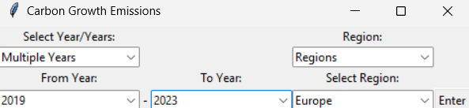
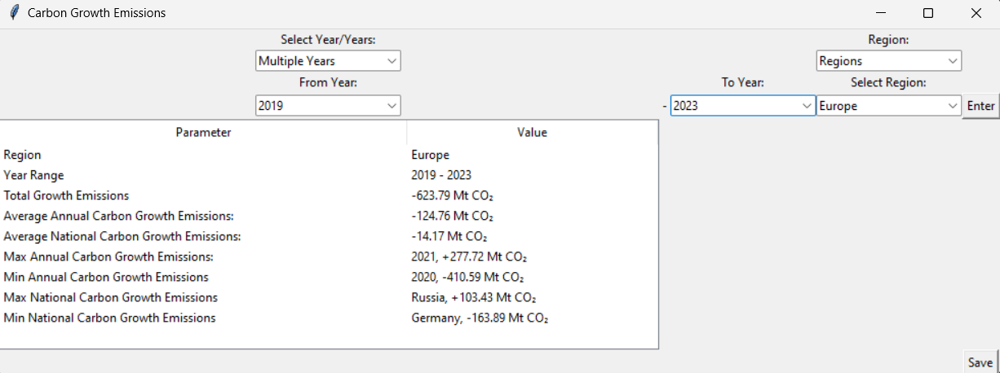

# Carbon-Growth-Emission-Dasboard
Carbon-Growth-Emission-Dasboard is a data analysis dashboard for carbon growth emissions in different regions and years.
##Table of contents
1. [Installation](#installation)
2. [Usage](#usage)
4. [License](#license)
## Installation

1. Clone the repository:
   ```bash
   git clone https://github.com/johnblessmbunga/Carbon-Growth-Emission-Dasboard.git
   cd Carbon-Growth-Emission-Dasboard
   npm install
## Usage
To strat application ,run:

npm start
### Features
__-Dashboard__: A dashboard is used for user input. Users can choose whether to analyse carbon growth emissions in a particular year or year range and in a particular region or country as shown in Figure 1. 
### Figure 1: Dasboard



__-Write and Save Report__: Writes a report table of different parameters regarding the carbon growth emissions in the selected time frame and region when the button _Enter_ is pressed as shown in Figure 2.
### Figure 2 : Dashboard with Report

The parameters vary depending on selection used. The common parameters include 

-region/country 

-year/year range

-total growth emissions.

Additional calculation are performed based on input:

If _year range_ is used the average, maximum , and minimum annual carbon growth emissions are calculated and presented.

If _region_ is selected the average, maximum, and minimum national carbon growth emissions are calculated and presented. 

Additionally, the width of the table changes depending on string length.

__-Save Report__: The report can be saved into an excel file by clicking the _Save_ button. The filename will be generated based on time frame and region selected.

__-Error Handling__: The calculations of the carbon growth emission parameters only begin when _Enter_ button pressed and all necessary inputs are valid.
## License
This project is licensed under _MIT license_.

### Acknowledgements
Thanks to the _Kagglehub_, _os_, _pandas_, _tkinter_, and _openpyxl_  library for providing backend framework. 
Addtionally I extend my thanks to _Samith Chimminiyan_ for creating and sharing dataset on Kagglehub
